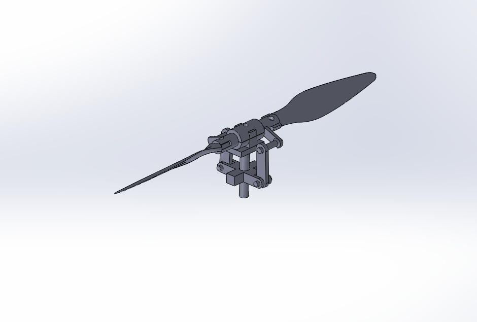
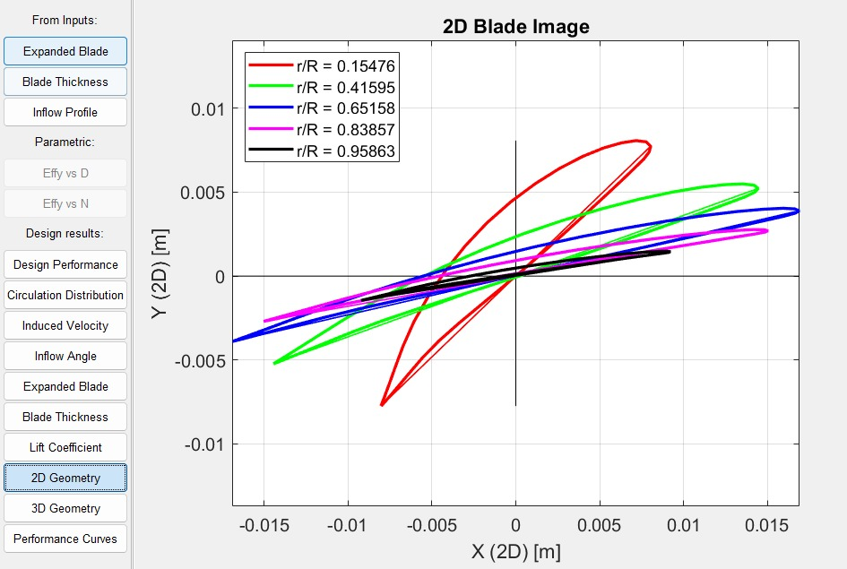
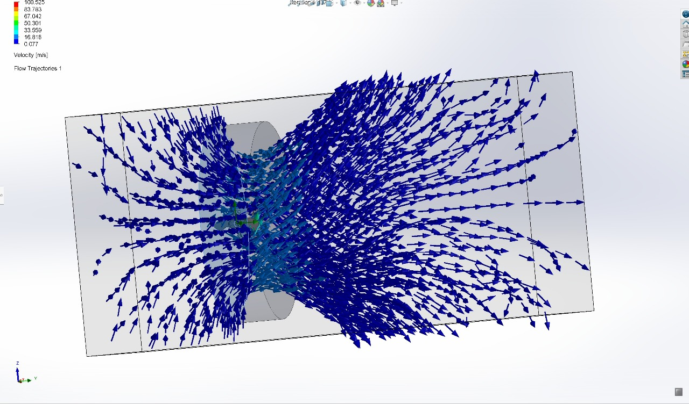
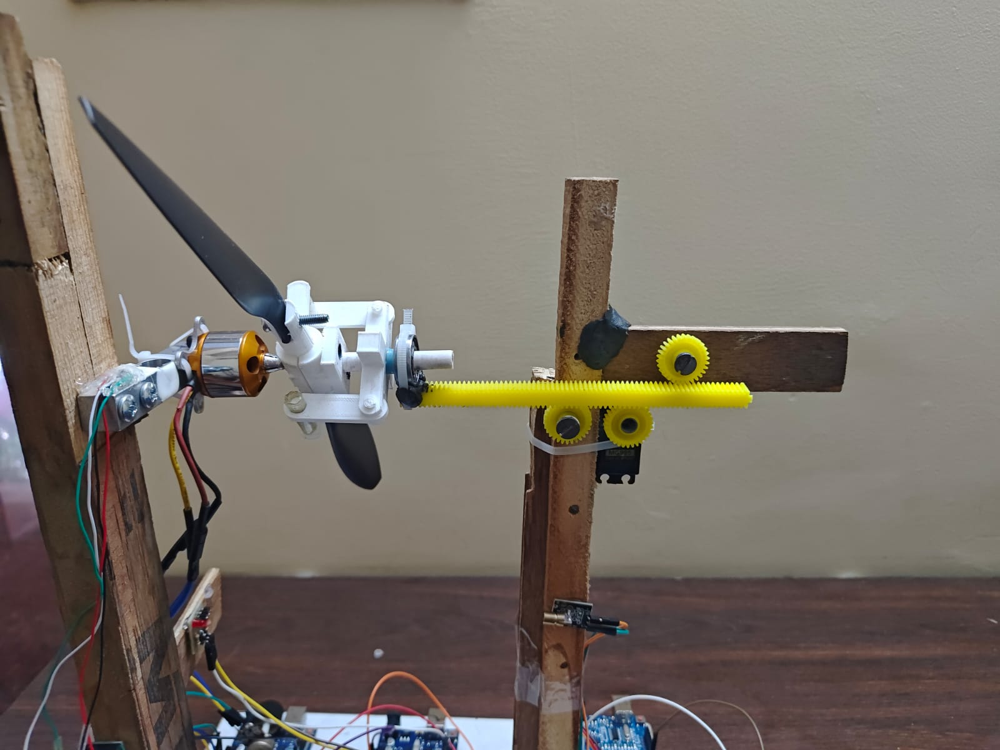
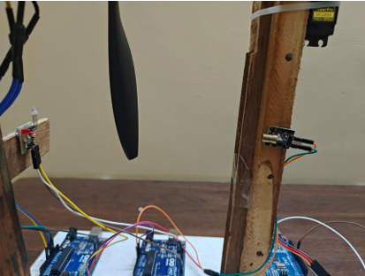
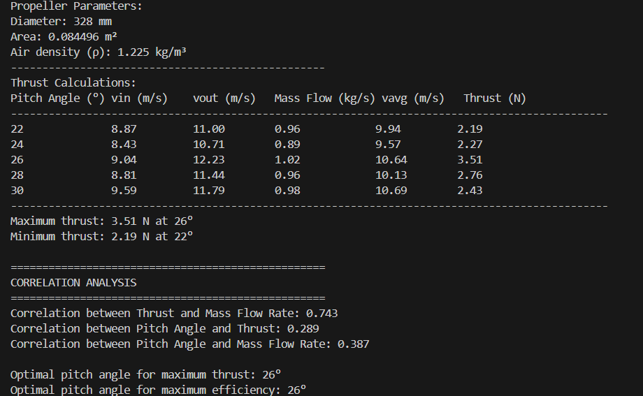
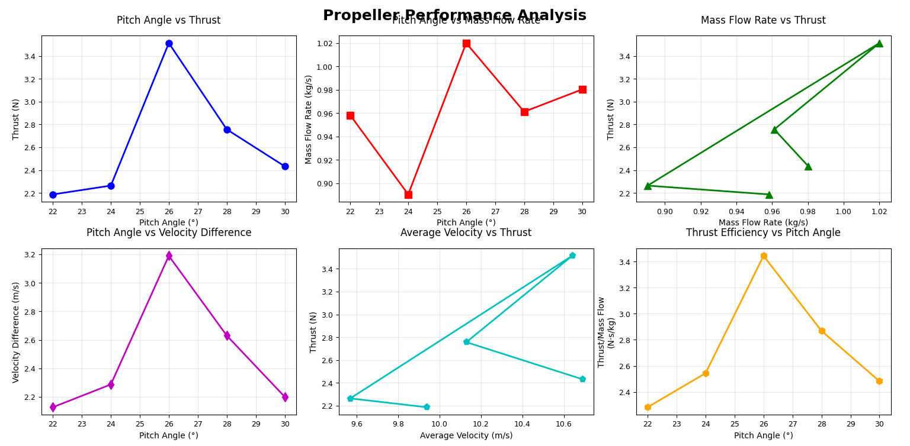

# Design and Prototype Development of a Variable Pitch Propeller with Test Bench

**RV College of Engineering | Aerospace Propulsion (AS343AI) | 2024-2025**

Designed, simulated, 3D-printed, and experimentally tested a manually variable-pitch propeller system — from blade theory and CAD through CFD validation to a self-built RPM and thrust measurement rig.



*SolidWorks assembly of the variable pitch hub, blades, and rack-and-pinion pitch control*

---

## Overview

Fixed-pitch propellers are only efficient at one design point. This project builds a small-scale variable pitch propeller to study how blade pitch angle affects thrust, and to prototype a low-cost mechanical system for adjusting it. The work spans four stages, all carried out end-to-end by the team:

1. **Blade design** — aerodynamic blade geometry generated using Blade Element Momentum Theory (OpenProp)
2. **CAD + CFD** — SolidWorks modelling of the hub/blade/pitch-control assembly, with Flow Simulation runs across 16 pitch configurations (0°–30°)
3. **Fabrication** — 3D-printed (FDM, PLA) blades and hub, assembled with a rack-and-pinion pitch-change mechanism
4. **Test bench** — a from-scratch rig using a BLDC motor + ESC, a laser-diode tachometer, and a custom load-cell thrust stand, all read out through Arduino

---

## 🙋 My Contribution
 
This was a team project across all four stages. My work was concentrated in **Fabrication** and the **Test Bench**:
 
| Area | What I Did |
|---|---|
| 🔧 **Pitch-Change Mechanism** | Designed the rack-and-pinion mechanism that translates a manual input into synchronized blade pitch rotation across all blades |
| 🖨️ **3D Printing / Fabrication** | Printed the blades and hub (FDM, PLA), including managing tolerances so the pitch mechanism assembled and rotated smoothly |
| 📟 **Tachometer Firmware** | Wrote the Arduino firmware for the laser-diode/photodiode tachometer — rising-edge interval timing to compute RPM in real time |
| ⚙️ **ESC / RPM Control** | Wrote the Arduino code controlling the BLDC motor's RPM through the ESC |
| 🧪 **Test Bench Assembly** | Assembled the complete rig — motor, ESC, tachometer, and load-cell thrust stand — into a working integrated test setup |
 
### Skills Learnt
 


 
- Designing a rack-and-pinion mechanism for synchronized multi-blade pitch actuation, and accounting for FDM print tolerances so it actually assembles and moves freely
- Non-contact RPM measurement via edge-triggered pulse timing (laser diode + photodiode), and diagnosing sensitivity to marker alignment and ambient light as a source of measurement error
- BLDC motor speed control through an ESC, driven from Arduino
- **System integration** — bringing independently-built subsystems (blade/CFD outputs from teammates, mechanism, drive, sensing, load measurement) together into one functioning test rig, where interface mismatches surface fast
- **Cross-functional coordination** — aligning fabrication tolerances and test-bench design against the blade geometry and pitch range defined by the CFD/blade-design sub-team
- **Root-cause troubleshooting under measured data** — using the ~2800–2950 RPM under-reading against a 3000 RPM target to isolate sensor alignment, not motor performance, as the likely cause

---

## Blade Design

The blade geometry (chord, thickness, and twist distribution at each radial station) was generated parametrically using **OpenProp**, based on target specs: 3 blades, 6000 RPM design point, 0.42 m rotor diameter, 20 N required thrust, 15 m/s advance speed.



*2D blade sections at five radial stations (r/R = 0.15 to 0.96), generated from BEMT-based parametric design*

The resulting profiles were exported and lofted into SolidWorks to build the 3D blade solid, hub, coupler, and locking-pin pitch control (16 discrete pitch configurations from 0° to 30° in 2° steps).

### OpenProp Input Specification

| Parameter | Value |
|---|---|
| Number of blades | 3 |
| Rotation speed (design) | 6000 RPM |
| Rotor diameter | 0.42 m |
| Hub diameter | 0.065 m |
| Required thrust | 20 N |
| Advance speed | 15 m/s |
| Fluid density | 1.225 kg/m³ |
| Radial panels / chordwise panels | 20 / 20 |

At each of the 10 radial stations (r/R = 0.2 to 1.0), OpenProp solved for the chord-to-diameter ratio (c/D), section drag coefficient (Cd), and thickness-to-diameter ratio (t0/D) needed to meet the thrust target at minimum induced loss — c/D peaks around r/R = 0.6–0.7 (~0.082) and tapers toward the tip, while t0/D falls monotonically from 0.0078 at the root to near-zero at the tip, consistent with a standard lift-carrying, structurally-tapered blade.

### Governing Relations

The blade twist and pitch angle β at radius r set the local geometric pitch:

```
P = 2πr·tan(β)
```

Propeller operating condition is characterized by the (dimensionless) advance ratio:

```
J = V / (n·D)      where V = advance velocity, n = rev/s, D = rotor diameter
```

For the servo-actuated pitch concept explored alongside the manual mechanism, the required actuator torque must overcome aerodynamic moment, mechanical friction, and the system's own rotational inertia:

```
T_motor = T_aero + T_friction + J_system·α_angular
```

This decomposition is what drives the mechanism-design constraints below (low friction, low added inertia) even though the built prototype uses manual pin-locked pitch rather than closed-loop servo control.

---

## CFD Simulation

SolidWorks Flow Simulation was used to evaluate each pitch configuration at a fixed rotational speed (3000 RPM), extracting thrust force, drag force, and lift-to-drag ratio per angle.



*Flow trajectory vectors through the rotating propeller domain, coloured by velocity*

**Setup / boundary conditions:**
- Rotating reference region (localized rotation domain) enclosing the propeller disk to simulate blade motion without meshing a moving assembly
- External flow domain set to environmental air at standard sea-level conditions and pressure
- Inlet velocity derived analytically from the 3000 RPM operating condition rather than measured, so simulation and later bench tests could be run at a matched design point
- All 16 pitch configurations (0°–30°, 2° steps) simulated individually and post-processed for thrust force, drag force, and lift-to-drag ratio
- Convergence tracked via goal plots on inlet/outlet average velocity and mass flow rate (both sides trending to a stable averaged value before a run was accepted)

**Stall behaviour:** flow simulations at the extremes (2° and 30°) showed clear flow separation and recirculation behind the disk — visible as disorganized, reversed velocity vectors immediately downstream of the blades rather than a clean accelerated jet. This confirms that both very low and very high pitch angles push the blade section past its usable angle of attack, while the 24°–28° range stayed attached and produced the highest thrust. At 20° pitch, by contrast, the velocity contour shows a coherent, well-formed downstream jet — the signature of attached flow doing useful aerodynamic work.

Simulated thrust rose from 0.12 N at 0° pitch to a peak of **2.20 N at 28°**, before tapering off — consistent with the expected pitch/stall trade-off, and matching the pitch angle at which the report identifies onset of stall-driven thrust roll-off.

---

## Fabrication

- 3D printed in **PLA (FDM)** — blades, hub, and coupler, sized directly from the SolidWorks assembly (no rescaling between CAD and print)
- Hub designed as a **modular socket assembly**: blade roots insert and lock into radial sockets, so blades can be swapped or re-seated without reprinting the hub
- Each blade fitted with **locking holes at discrete pitch increments**, so pitch could be set manually with alignment pins and held fixed for the duration of a test run (a deliberate simplification vs. continuous/servo actuation, chosen for repeatability during bench testing)
- Post-print finishing: blades were **sanded** to remove FDM layer ridges (a factor later flagged as a possible source of extra lift/drag vs. the smooth CFD geometry) and **statically balanced** before mounting, to keep vibration and bearing load low at test RPM

---

## Pitch Change Mechanism

A **rack-and-pinion** mechanism was built to translate a single linear input into synchronized rotation of the blade roots — a low-friction, easily inspectable alternative to a swashplate for a bench-scale prototype.



*Yellow gear rack meshing with pinion gears at each blade root, driven via a servo linkage*

Design constraints considered: keeping the mechanism lightweight so it doesn't unbalance the disk, minimizing friction at the blade-root bearings, ensuring the rack/pinion and root bearings survive centrifugal loading at operating RPM, and holding pitch angle repeatability to within about ±1°.

**Design considerations weighed before settling on rack-and-pinion:**

| Mechanism | Trade-off |
|---|---|
| Rotating collar (RC-aircraft style) | Simple, servo-actuated via linkages; well-proven for small props but harder to inspect mid-test |
| **Rack-and-pinion (chosen)** | Central rack drives all blade pinions in sync from one linear input; easy to visually verify pitch angle, more mechanically direct for a bench prototype |
| Swashplate | Enables cyclic + collective pitch (helicopter/quadcopter style); unnecessary complexity for a single-axis thrust study |

Blade root bearings (radial + thrust type) carry the centrifugal load and let each blade rotate about its own axis with minimal resistance; the rack itself was sized to survive the ~3000–5000 RPM centrifugal load range without deforming, while staying light enough not to unbalance the disk.

---

## Test Bench: RPM Control & Measurement

| Component | Role |
|---|---|
| BLDC motor | Propulsion source, rated for continuous operation at 3000 RPM |
| ESC | Converts Arduino PWM signal into motor drive current |
| Arduino + potentiometer | Manual throttle input, varying motor speed via PWM |
| Laser-diode tachometer (custom-built) | Non-contact RPM sensing off a reflective marker on the hub |



*Laser-diode tachometer (left) and servo-driven pitch linkage (right) either side of the running propeller*

The tachometer was built from a laser diode and photodiode pair: the beam is interrupted once per revolution by a reflective marker on the rotating hub, and the resulting pulse train is timed on the Arduino (rising-edge interval → RPM = 60 / interval_seconds) to compute rotational speed in real time. Being non-contact, it avoids adding load or drag to the shaft, but is sensitive to marker alignment and ambient light — a factor the team later flagged as a likely source of the ~2800–2950 RPM under-reading against the 3000 RPM target.

---

## Test Bench: Thrust Measurement

A **custom load-cell thrust stand** was built to measure axial thrust directly, rather than inferring it from motor current or RPM alone:

| Component | Description |
|---|---|
| Load cell | 5 kg strain gauge, linear output |
| HX711 amplifier | Signal conditioning / ADC for the load cell |
| Arduino UNO | Logs thrust readings alongside RPM |
| Test stand | Rigid wooden frame isolating the load cell from vibration and torque reaction |


*Full bench: BLDC motor and propeller mounted on the wooden test stand, wired to the three Arduinos handling throttle, tachometer, and load cell*

**Procedure:** blade pitch was locked at a target angle, RPM was ramped to the test condition via the throttle potentiometer, and thrust was logged over five trials per configuration to average out fluctuation before moving to the next pitch angle. The load cell's strain-gauge bridge produces a millivolt-level differential signal proportional to axial deflection; the HX711 amplifies and digitizes this (24-bit ADC) before the Arduino converts it to a calibrated force reading, so thrust is measured directly rather than backed out from motor current or RPM.

---

## Results

### Simulated vs. Experimental Thrust

| Pitch Angle (°) | Simulated Thrust (N) | Experimental Thrust (N) |
|---|---|---|
| 0 | 0.12 | 0.16 |
| 2 | 0.26 | 0.29 |
| 4 | 0.39 | 0.41 |
| 24 | 2.10 | 2.81 |
| 26 | 2.18 | 2.90 |
| **28** | **2.20** | **3.00** |
| 30 | 2.19 | 2.97 |

**Maximum thrust of 3.00 N was measured at 28° pitch**, closely tracking the CFD-predicted trend. Experimental values ran consistently 10–15% above simulation — attributed to real airflow effects the simulation doesn't capture, plus a small systematic RPM under-reading from the tachometer (∼2800–2950 RPM logged against a 3000 RPM target), which alone would explain part of the gap.

**Identified sources of error:**

| Source | Explanation |
|---|---|
| Tachometer delay/error | Laser tachometer under-read actual RPM, biasing the effective thrust-per-RPM comparison |
| Airflow recirculation | Indoor test environment caused unsteady, wall-reflected flow near the propeller — not present in the open CFD domain |
| Load cell drift | Minor thermal/electrical drift in the strain-gauge signal over a test session |
| 3D-print surface roughness | FDM layer lines on the blade surface likely increased local lift beyond the smooth-surface CFD prediction |

### Independent Momentum-Theory Analysis

As a cross-check on the bench data, thrust was also estimated independently using classical **actuator-disk (momentum) theory**, scripted in Python from measured inlet/outlet velocity data:

```
ṁ     = ρ · A · v_avg          (mass flow rate through the disk)
v_avg = (v_in + v_out) / 2     (average velocity across the disk)
T     = ṁ · (v_out − v_in)     (axial thrust from momentum change)
```

with propeller area `A = 0.0845 m²` (328 mm diameter) and standard sea-level air density `ρ = 1.225 kg/m³`. Unlike the CFD run, this treats the propeller as a simple actuator disk accelerating a bulk flow — no blade-resolved pressure distribution — so it trades some fidelity for a fast, independent sanity check on the bench numbers.



*Thrust calculated from measured inlet/outlet velocity and mass flow rate at each pitch angle, with correlation analysis*



*Pitch angle vs. thrust, mass flow rate, velocity difference, and thrust efficiency (thrust per unit mass flow)*

This analysis (328 mm propeller, standard sea-level air density) found the strongest correlation between thrust and mass flow rate (r = 0.74), a much weaker correlation between pitch angle and thrust directly (r = 0.29), and a moderate correlation between pitch angle and mass flow rate (r = 0.39). In other words, thrust here tracks *how much air the disk is moving* far more tightly than it tracks pitch angle in isolation — pitch angle only matters insofar as it changes the mass flow, which is exactly what momentum theory predicts. Peak thrust and peak thrust-per-unit-mass-flow (efficiency) both landed at **26° pitch** in this dataset — close to, though not identical to, the 28° optimum from the CFD/experimental comparison above. The offset is consistent with the difference in method: momentum theory here uses bulk inlet/outlet velocity rather than a full blade-resolved pressure field, so it functions as an independent sanity check rather than a replacement for the CFD result.

---

## Limitations & Future Work

**Current limitations:**
- Pitch is set manually via alignment pins between runs — no in-flight or real-time pitch adjustment, so dynamic (transient) pitch effects couldn't be studied
- Indoor testing introduced airflow recirculation and wall effects not present in the open CFD domain
- Laser tachometer accuracy (±10 RPM, with observed under-reading) and load-cell drift both place a floor on measurement precision

**Natural next steps:**
- Replace manual pin-locking with **servo-actuated pitch control**, closing the loop with a PID controller so RPM and pitch can be regulated together against a thrust target
- Move testing to an **open-jet wind tunnel** or outdoor setup to eliminate recirculation and validate the CFD boundary conditions more directly
- Cross-check RPM readings with a **high-speed camera** in addition to the laser tachometer
- Rebuild blades in **carbon-fiber or composite** for a better strength-to-weight ratio at higher RPM, and refine blade twist/airfoil profiling beyond the current OpenProp baseline

---

`OpenProp (BEMT)` `SolidWorks` `SolidWorks Flow Simulation (CFD)` `3D Printing (FDM, PLA)` `Arduino` `HX711 Load Cell Amplifier` `Python (data analysis)`

---

## Repository Structure

```
variable-pitch-propeller-test-bench/
├── README.md
├── arduino-code/       # speed-control, tachometer, and load-cell sketches
├── cad/                # STEP/SLDPRT files + exported renders
├── media/
│   ├── images/         # photos, diagrams, wiring images
│   └── *.mp4           # videos
└── docs/               # full project report + presentation
```

---

## Team

**Aerospace Propulsion Project (AS343AI), Department of Aerospace Engineering, RV College of Engineering**
Akula Uday Kiran · Rutuj Dugad Manoj · Shanthosh K V · **Tejas L** · Yashwanth R

*Guided by Dr. Supreeth R, Associate Professor & Head, Department of Aerospace Engineering*
